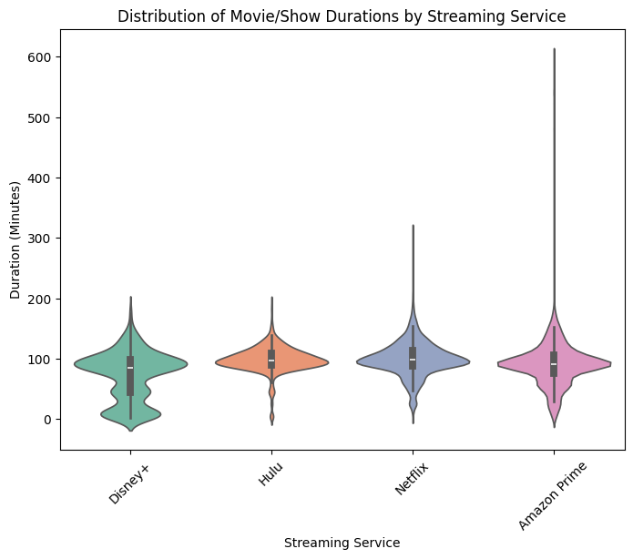

# **Streaming Services Analysis**

## *Analysis Overview:*

This analysis will dive into data from four leading streaming platforms—Netflix, Hulu, Amazon Prime, and Disney+—to explore trends, viewership patterns, and key performance metrics. By examining each service's unique offerings and subscriber behaviors, we aim to uncover insights that highlight their market positions and user preferences in the ever-evolving digital entertainment landscape.

### Distribution of Movie/Show Durations by Streaming Service

{width="500"}

The violin plot reveals a striking contrast in content duration across platforms. Amazon Prime stands out with the broadest range, extending to exceptionally lengthy content (up to 600 minutes), suggesting a focus on longer films and series. In contrast, Disney+ exhibits the shortest content range, implying a preference for more concise viewing experiences.  Netflix and Hulu fall somewhere in between, with Netflix showing a slightly wider spread than Hulu. 

### Number of Titles Added Over Time

{width="1000"}

This chart highlights the aggressive content acquisition strategy employed by Netflix.  Starting around 2016, Netflix embarked on a dramatic expansion of its library, consistently adding new titles at a pace that far surpassed its competitors.  While other platforms also increased their offerings, their growth trajectories were notably less steep, underscoring Netflix's commitment to content dominance.

### Distribution of Movie Ratings Across Platforms

{width="1000"}

The distribution of movie ratings reveals distinct content preferences across platforms.  Amazon Prime caters to a more mature audience with a significant concentration of TV-MA rated content. In contrast, Disney+ likely focuses on family-friendly viewing, as suggested by its lower proportion of mature ratings (though specific data on G and PG ratings is not available here). Netflix and Hulu demonstrate a more balanced approach, offering a mix of ratings to appeal to a broader audience.

## *Conclusion:*

This analysis has illuminated key differences in content strategies across the four streaming platforms. Each exhibits distinct trends in content offerings, duration, and release timing, catering to diverse viewer preferences.  Amazon Prime, with its extensive library and broad range of content durations, including a substantial offering of mature titles, appears to prioritize attracting a diverse and mature audience.  Netflix, while showing signs of slowing growth in recent years, still boasts a massive library and a history of aggressive content acquisition, suggesting a focus on breadth and variety. 


## Code used for analysis:

```zsh
import pandas as pd
import polars as pl
import seaborn as sns
import matplotlib.pyplot as plt

# --- Load Data ---
disney = pl.read_csv("/Users/scotttow123/Documents/Streaming_Services/Data/disney_plus_titles.csv")
hulu = pl.read_csv("/Users/scotttow123/Documents/Streaming_Services/Data/hulu_titles.csv")
netflix = pl.read_csv("/Users/scotttow123/Documents/Streaming_Services/Data/netflix_titles.csv")
prime = pd.read_csv("/Users/scotttow123/Documents/Streaming_Services/Data/amazon_prime_titles.csv")

disney = disney.with_columns(pl.lit("Disney+").alias("platform"))
hulu = hulu.with_columns(pl.lit("Hulu").alias("platform"))
netflix = netflix.with_columns(pl.lit("Netflix").alias("platform"))

disney = disney.to_pandas()
hulu = hulu.to_pandas()
netflix = netflix.to_pandas()

prime["platform"] = "Amazon Prime"

data = pd.concat([disney, hulu, netflix, prime], ignore_index=True)

def convert_duration(duration):
    if pd.isna(duration):
        return None
    duration = str(duration).lower()
    if "min" in duration:
        return int(duration.replace(" min", ""))
    elif "h" in duration:
        parts = duration.split(" ")
        hours = int(parts[0].replace("h", "")) * 60
        minutes = int(parts[1].replace("min", "")) if len(parts) > 1 else 0
        return hours + minutes
    return None

data["duration_minutes"] = data["duration"].apply(convert_duration)

data["date_added"] = pd.to_datetime(data["date_added"], errors="coerce")
data["year_added"] = data["date_added"].dt.year

plt.figure(figsize=(8, 6))
sns.violinplot(data=data, x="platform", y="duration_minutes", palette="Set2")
plt.title("Distribution of Movie/Show Durations by Streaming Service")
plt.xlabel("Streaming Service")
plt.ylabel("Duration (Minutes)")
plt.xticks(rotation=45)
plt.show()

plt.figure(figsize=(18, 6))
df_yearly = data.groupby(["year_added", "platform"]).size().reset_index(name="count")
sns.lineplot(data=df_yearly, x="year_added", y="count", hue="platform", marker="o")
plt.title("Number of Titles Added Over Time")
plt.xlabel("Year")
plt.ylabel("Number of Titles")
plt.legend(title="Streaming Service")
plt.show()

plt.figure(figsize=(30, 6))
sns.histplot(data=data, x="rating", hue="platform", multiple="stack", palette="Set1", shrink=0.8)
plt.title("Distribution of Movie Ratings Across Platforms")
plt.xlabel("Rating")
plt.ylabel("Count of Titles")
plt.xticks(rotation=45)
plt.legend(title="Streaming Service")
plt.show()
```